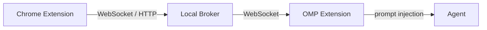

# OMP Browser Feedback

Pick any element on a web page, annotate it with instructions, and send it
straight to your coding agent — without leaving the terminal.

The Chrome extension highlights DOM elements, captures context and screenshots,
and routes feedback through a local loopback broker to an active OMP session.
The agent receives a structured prompt it can act on immediately.



## Architecture

| Component | Location | Role |
|-----------|----------|------|
| **Chrome Extension** | `packages/browser-extension` | DOM picker, screenshot capture, content scripts, popup |
| **Broker** | `packages/browser-broker` | Local loopback server (WebSocket + HTTP) with session registry and feedback store |
| **OMP Extension** | `packages/browser-omp-extension` | `/bf` commands, broker lifecycle, feedback rendering |
| **Protocol** | `packages/browser-protocol` | Shared types, schemas, validation, and version constants |

The broker runs on `127.0.0.1` (default port `4317`, range `4317-4337`).
All traffic stays on loopback — nothing leaves your machine.

## Quickstart

### Prerequisites

- Google Chrome or Chromium (Manifest V3)
- [Oh My Pi](https://github.com/can1357/oh-my-pi) installed (`bun install -g oh-my-pi`)
- The `omp-browser-feedback` package: `bun add omp-browser-feedback`

### Install

1. Install the Chrome extension from the
   [Chrome Web Store](https://chromewebstore.google.com/detail/omp-browser-feedback)
   or load it unpacked from `packages/browser-extension/dist/`.

2. Start an OMP session in your project directory:

```bash
omp
```

The broker starts automatically and the session registers.

3. In the OMP session, generate a pairing code:

```
/bf pair
```

Output:

```
Pairing code: A7K2M9
Open the browser extension and enter the code before it expires.
Expires: 2026-07-18T12:05:00.000Z
```

4. Click the Chrome extension icon, enter the pairing code, and click **Pair**.

5. Select your OMP session from the list.

6. Click **Pick element** (optionally type a note first).

7. Click any element on the page — the picker activates with a crosshair cursor.

8. The element is highlighted, context is captured, and the feedback is routed
   to your OMP session. The agent receives a structured prompt with the element
   selector, HTML, accessibility tree, and any annotation you provided.

### What the agent receives

For a DOM selection, the agent gets a prompt like:

```
The user selected a browser element and provided implementation feedback.

Element: <button#submit.btn-primary> ([data-testid="submit-btn"])
Selector: [data-testid="submit-btn"]
Outer HTML:
<button id="submit" class="btn-primary" data-testid="submit-btn">
  Submit Order
</button>

Accessibility:
{
  "role": "button",
  "name": "Submit Order"
}

Note: "Change the button color to green"

Locate the owning source/component in your project and address the user's
request. Treat selector and HTML data as runtime evidence; verify the source
implementation before editing.
```

## Commands

All commands are prefixed with `/bf`. Type `/bf` alone for usage.

| Command | Description |
|---------|-------------|
| `/bf connect` | Start or reuse the broker, register the current session |
| `/bf disconnect` | Unregister the current session from the broker |
| `/bf status` | Show broker, connection, session, and auto-run state |
| `/bf broker start [--port=N] [--port-range=N-M]` | Start the in-process broker |
| `/bf broker stop` | Stop the in-process broker |
| `/bf broker status` | Check if the in-process broker is running |
| `/bf pair` | Open a pairing window and display a one-time code |
| `/bf pair reset` | Revoke all browser capability tokens (all browsers must re-pair) |
| `/bf latest` | Show the most recent feedback event for the session |
| `/bf list` | List all feedback events for the session |
| `/bf use [eventId]` | Show a specific feedback event (or the latest) |
| `/bf clear` | Clear all feedback events for the session |
| `/bf rename <name>` | Update the session display name |
| `/bf settings auto-run on` | Submit feedback automatically (no editor review) |
| `/bf settings auto-run off` | Pre-fill the prompt box for manual review (default) |

### Expected output

| Command | Expected output |
|---------|----------------|
| `/bf connect` | `Broker: http://127.0.0.1:4317 (started)` then `Session: <name>` |
| `/bf connect` (already running) | `Broker: http://127.0.0.1:4317 (already running)` |
| `/bf disconnect` | `Session unregistered from browser broker.` |
| `/bf status` | Multi-line: broker state, connection state, session registration, active session count, auto-run toggle |
| `/bf broker start` | `Browser broker started at http://127.0.0.1:4317 (port 4317).` |
| `/bf broker start` (already running) | `Browser broker already running at http://127.0.0.1:4317 (port 4317).` |
| `/bf broker stop` | `Browser broker stopped.` or `No in-process browser broker is running.` |
| `/bf pair` | `Pairing code: XXXXXX` then `Expires: <ISO timestamp>` |
| `/bf pair reset` | `Browser pairing reset. All browsers must pair again.` |
| `/bf latest` | Rendered feedback context or `No browser feedback received for this session.` |
| `/bf list` | `<eventId> <type>` per event, or `No browser feedback received for this session.` |
| `/bf use <id>` | Rendered feedback context or `Browser feedback event <id> not found.` |
| `/bf clear` | `Cleared N browser feedback event(s).` |
| `/bf rename <name>` | `Session display name updated to "<name>".` |
| `/bf settings auto-run on` | `browser-feedback: auto-run on — feedback will be submitted automatically` |
| `/bf settings auto-run off` | `browser-feedback: auto-run off — feedback will pre-fill the prompt box` |

### Error states

| Error | Meaning |
|-------|---------|
| `Browser broker is not connected. Use /bf connect first.` | No discovery file found; broker not running |
| `Failed to connect: <message>` | Broker start or registration failed |
| `Failed to open pairing window: <message>` | Pairing code issuance failed (e.g. unknown session) |
| `Failed to unregister: <message>` | Session deregistration failed |
| `Broker reachable but status check failed: <message>` | Broker is up but session listing failed |
| `No in-process browser broker running.` | `/bf broker stop` called with no active broker |
| `Failed to start browser broker: <message>` | Port range exhausted, all ports occupied |
| `Failed to rename session: <message>` | Session update failed |

### Picker behavior

- **Activation**: Click **Pick element** in the popup or use `/bf` auto-pick.
- **Crosshair cursor**: The overlay covers the page; mouseover highlights elements.
- **Selection**: Click to capture the element. Press `Escape` to cancel.
- **Shadow DOM**: The picker traverses shadow roots to reach nested elements.
- **Tree walk**: The selector generator walks parent elements to build a unique CSS path, preferring `data-testid`, `aria-label`, `id`, and `name` attributes.
- **Region capture**: The screenshot crops around the selected element with 40px padding.
- **Full-page fallback**: If cropping produces an invalid region, the full visible tab is captured.
- **Annotation**: Optional note typed in the popup before picking, included in the agent prompt.

### Console consent

The Chrome extension requires the `activeTab` permission, which grants access
to the current tab only when the user clicks the extension icon. No background
tab monitoring occurs. The `scripting` permission is used solely to inject the
picker overlay on demand.

## Troubleshooting

### Port collision / exhaustion

The broker tries ports `4317` through `4337` (configurable via `--port-range`).
If all are occupied, it falls back to port `0` (OS-assigned).

```bash
# Check what's using port 4317
lsof -i :4317

# Start on a specific port
/bf broker start --port=4400

# Use a custom range
/bf broker start --port-range=4400-4420
```

### Stale discovery file

If the broker crashes, the discovery file at `~/.omp/browser-broker.json`
may point to a dead process. The extension probes the health endpoint on
load — if it fails, it shows **no-broker** and you can re-pair.

```bash
# Remove stale discovery file
rm ~/.omp/browser-broker.json
```

### Broker replacement

If you start a new OMP session while an old broker is running, the new
session reuses the existing broker (same port, same auth token). The old
session's WebSocket disconnects and its status becomes `disconnected`.

To force a clean start:

```bash
/bf broker stop
/bf broker start
```

### Capability registry: preserved / lost / revoked

Browser capability tokens are stored in `~/.omp/browser-pairing-registry.json`.
They survive broker restarts but are lost if:

- The registry file is deleted.
- `/bf pair reset` is called (revokes all tokens).
- The file is corrupted (auto-quarantined on load).

After revocation, every browser must re-pair using a new code.

### Extension reload / MV3 idle

Chrome's Manifest V3 service worker can go idle after ~30 seconds of
inactivity. The extension re-activates on the next message or popup open.
If the picker was active when the service worker idled, the picker
deactivates — re-click **Pick element** to restart.

### Missing / stale sessions

If the OMP session exits and restarts, the old session entry shows as
`disconnected` in the broker's session list. The extension lists only
`active` sessions by default. If no active sessions appear:

1. Ensure the OMP session is running.
2. Run `/bf status` to verify registration.
3. Run `/bf pair` to re-generate a pairing code if needed.

### Payload / version errors

The broker validates all payloads against the protocol schema. If the Chrome
extension sends a malformed event, the broker responds with:

```json
{"ok": false, "code": "invalid_feedback", "message": "<validation error>"}
```

This usually indicates a version mismatch between the Chrome extension and
the broker protocol. Ensure both are up to date.

## Privacy

See [docs/privacy.md](docs/privacy.md) for the full privacy disclosure.

### Summary

- **Browser data captured**: DOM element selector, outer HTML (truncated to 20KB),
  computed styles (up to 80 properties), accessibility tree, and an optional
  screenshot (cropped around the element, max 10MB).
- **Consent**: No data is captured until you click an element with the picker
  active. The `activeTab` permission only grants access when you click the
  extension icon. The `storage` permission persists broker URL and capability
  token only. The `tabs` permission captures screenshots on demand.
- **Transport**: All traffic is loopback-only (`127.0.0.1`, host permission
  `http://127.0.0.1:*/*`). Bearer-token auth (bearer token in `Authorization`
  header) on every non-health endpoint. Nothing leaves your machine.
- **On-disk**: Discovery file at `~/.omp/browser-broker.json`, pairing registry
  at `~/.omp/browser-pairing-registry.json`, config at
  `~/.omp/browser-feedback.json`, screenshots at
  `/tmp/omp-browser-screenshots/`.
- **Retention**: Feedback events are in-memory only (bounded per session).
  Screenshots persist until broker shutdown. Discovery and pairing files persist
  on disk.
- **Revocation**: `/bf pair reset` revokes all browser capability tokens
  immediately.

## Versioning

| Artifact | Version | Source |
|----------|---------|--------|
| **Protocol** (`BROWSER_PROTOCOL_VERSION`) | `1` | `packages/browser-protocol/src/version.ts` |
| **Chrome Extension** (manifest `version`) | `0.1.0` | `packages/browser-extension/manifest.json` |
| **OMP Package** (`omp-browser-feedback`) | `0.0.8` | `packages/browser-omp-extension/package.json` |

The Chrome Web Store zip uses the Chrome Extension version (`0.1.0`), not the
protocol or OMP package version.

## Building

```bash
# Install dependencies
bun install

# Build the OMP extension (required before testing)
bun run build:omp-extension

# Build the Chrome extension
bun run build:extension

# Build the Chrome Web Store zip
bun run build:store

# Run all checks
bun run check

# Run all tests
bun run test
```

## Package structure

```
omp-browser-feedback/
├── packages/
│   ├── browser-protocol/     # Shared types, schemas, validation
│   ├── browser-broker/       # Local loopback broker server
│   ├── browser-extension/    # Chrome extension (Manifest V3)
│   └── browser-omp-extension/ # OMP agent integration (/bf commands)
├── scripts/
│   ├── prepare-release-package.ts  # npm publish prep
│   ├── check-against-omp-head.ts   # OMP host compatibility check
│   └── build-store-zip.ts          # Chrome Web Store zip builder
├── test/
│   ├── prepare-release-package.test.ts
│   ├── standalone-omp-package-smoke.test.ts
│   ├── check-against-omp-head.test.ts
│   ├── store-zip-check.test.ts
│   ├── command-doc-check.test.ts
│   └── privacy-inventory-check.test.ts
├── docs/
│   ├── privacy.md
│   ├── compatibility-matrix.md
│   └── web-store-listing.md
└── README.md
```

## License

MIT
